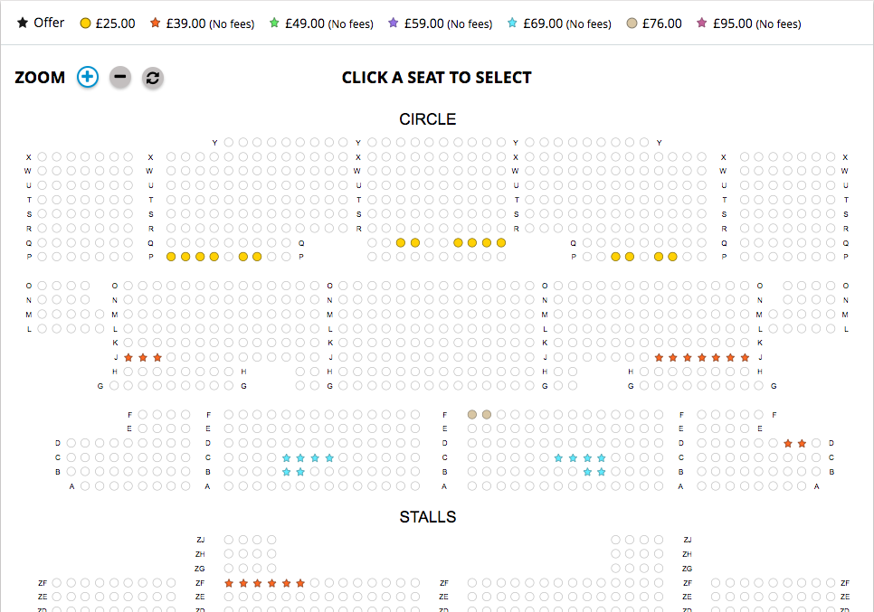

# Encoretickets pair test

The goal of this test is to have a technical conversation while implementing 
a solution to a user problem: Seats lumping.

First we're going to explain the domain of our problem and then expose the
desired solution.

## Seat lumping domain

We're selling tickets for shows, they can be Theatre, Musicals, Music Concert etc...
Let's have a look at our ubiquitous language.

- A show is defined by a product (example: "Wicked"), a date and a time.
- A ticket is defined by a show and a seat (example: row A, number 3).

A customer can select a lump of seats on a venue seat plan.

- A lump is a series of adjacent seats within a group of seats.
- A group of seat is a series of adjacent seats of a specific price, they belongs
to one area in the venue.

The seat plan is displayed with all seats. Available seats groups are displayed
with a specific color depending on the price.



You can find and example of a list of available seats groups for a show from our
Inventory API in the file `availability.json`

You can retrieve the data with our Mock http client like this:

```
$client = new MockInventoryHttpClient();
$responseBody = $client->request('GET', '/availability/products/1587/quantity/2/seats?date=20190111&time=1930');
```

## The problem

Provided the above example of data, we would like to be able to give a list of possible
seat lumps given a number of desire seats.

### Lump policy

In order to maximise the number of tickets that can be sold for a show, we cannot sell
a lump of seats that result of making isolated seat.

Examples: 
Group of seats: A1, A2, A3, A4
For a lump size of 2, we can sell: (A1, A2) or (A3, A4) but not (A2, A3) 
as it will isolate A1 and A4
 
